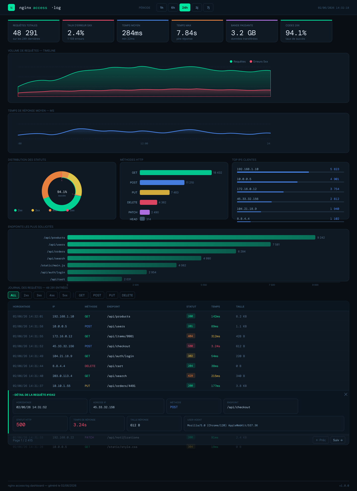

# Dinolog

Dinolog is a log exploration tool for nginx.

## Goal

Read nginx access logs, parse them, put them into a database and provide a web interface to explore the logs.

## Log parsing principle

By default, nginx access logs are written in a specific format. Dinolog uses this format to parse the logs and extract relevant information such as IP address, request method, URL, response status, and more.

A regular expression is used to match the log entries: `^(\S+) - (\S+) \[([^\]]+)\] "(\S+) (.*?) (\S+)" (\d{3}) (\d+) "([^"]*)" "([^"]*)"$`

See the [nginx logging documentation](https://docs.nginx.com/nginx/admin-guide/monitoring/logging/) for more information on log formats.

## Backend

The backend of Dinolog is built in Rust and uses the axum framework to provide a REST API for the frontend. The backend is responsible for reading the logs, parsing them, and storing them in a database.

## ORM

Dinolog uses the `sea-orm` crate as an ORM to interact with the database. The ORM provides a convenient way to define models and perform database operations.

## Database

Dinolog uses PostgreSQL as the database to store the parsed log data. The database schema is designed to efficiently store and query log entries.

## Frontend

The frontend of Dinolog is built using Flutter and provides a user-friendly interface to explore the logs. The frontend communicates with the backend via REST API calls to fetch log data and display it in a meaningful way.